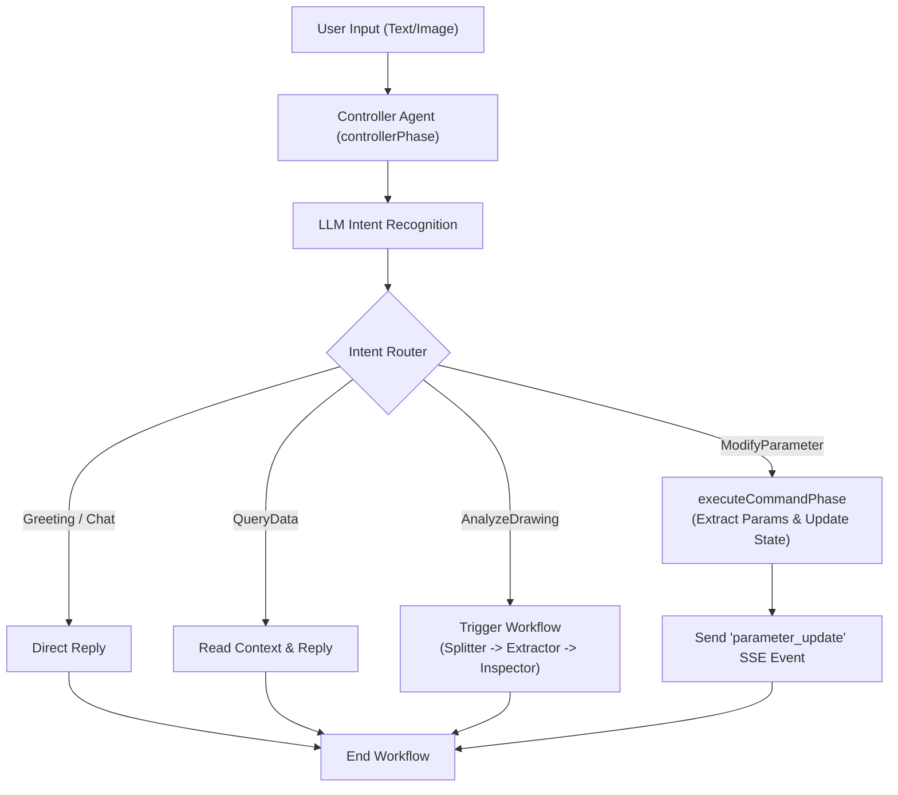

# Intent Recognition & Tool Calling Implementation Plan

## 1. 架构重构：持久化会话与上下文记忆 (Session & Context)
为了让 AI 能够理解“目前的板厚”或“缩小它的边长”，系统必须具备上下文记忆。
*   **前端改造 (`components/CopilotChat/useSSEConnection.ts`)**:
    *   在 Hook 初始化时生成一个固定的 `sessionId`，并立即建立 SSE 连接 (`GET /stream/:sessionId`)。
    *   修改 `sendMessage` 方法，在 `POST /chat` 时携带该 `sessionId`，而不是每次都等待后端返回新的 ID。
*   **后端改造 (`server/src/routes/agent.ts` & `server/src/types.ts`)**:
    *   引入 `SessionStore` 概念，独立于单次工作流执行。Session 中需要保存 `chatHistory` (历史对话) 和 `extractedParams` (当前提取的零件参数)。
    *   修改 `/chat` 接口，接收前端传来的 `sessionId`，获取对应的 Session 上下文，并将其传递给 `AgentWorkflow`。

## 2. 核心大模型能力补充 (LLM Tools & Prompts)
*   **工具层 (`server/src/agents/tools.ts`)**:
    *   新增 `callTextModel` 方法。目前的工具主要针对视觉 (`callVisionModel`)，意图识别通常只需要纯文本大模型即可完成，以提高响应速度并降低成本。
*   **Prompt 层 (`server/src/agents/prompts.ts`)**:
    *   新增 `INTENT_RECOGNITION_PROMPT`。该 Prompt 需要定义输入格式（用户消息、当前参数状态、是否包含文件）和严格的 JSON 输出格式（包含 `intent`, `reply`, `actionDetails`）。

## 3. 意图路由引擎实现 (Intent Router)
*   **工作流改造 (`server/src/agents/workflow.ts`)**:
    *   重写 `controllerPhase` 方法。
    *   在阶段开始时，组装当前上下文（历史记录 + 当前参数状态 + 用户最新输入），调用 `callTextModel` 进行意图识别。
    *   实现 `switch-case` 路由逻辑：
        *   `Greeting / Chat` & `QueryData`: 直接通过 SSE 发送 `reply` 给用户，随后调用 `this.complete()` 结束当前工作流。
        *   `AnalyzeDrawing`: 按照原有逻辑，依次调用 `splitterPhase`, `extractorPhase`, `inspectorPhase`。
        *   `ModifyParameter`: 路由至新增的 `executeCommandPhase`。

## 4. 指令执行与前端状态同步 (Tool Execution & State Sync)
*   **后端指令执行 (`server/src/agents/workflow.ts`)**:
    *   新增 `executeCommandPhase(actionDetails)` 方法。
    *   根据 `actionDetails` 中的 `target`, `parameter`, `value` 更新 Session 中的 `extractedParams`。
    *   向前端发送一条新的 SSE 事件（例如类型为 `parameter_update`），携带最新的参数数据。
    *   通过 SSE 发送执行成功的文本回复给用户。
*   **前端状态响应 (`components/CopilotChat/useSSEConnection.ts` & `types.ts`)**:
    *   在 SSE 事件处理 `handleSSEEvent` 中增加对 `parameter_update` 的支持。
    *   将更新后的参数状态暴露给父组件，以便左侧的 3D 视图或参数表单能够实时响应 AI 的修改。

## 意图路由流程图

