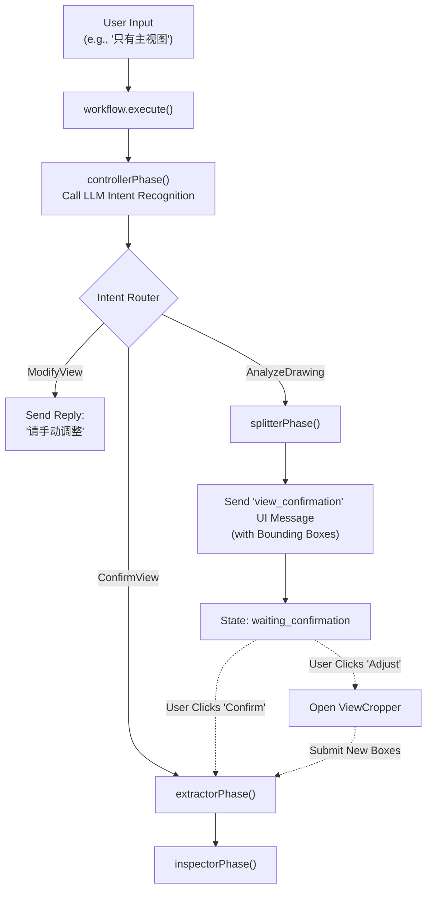

# Interactive View Confirmation & Bug Fixes Implementation Plan

## 1. 修复核心 Bug (Bug Fixes)
*   **修复 3D 渲染崩溃 (`components/ThreeDViewer.tsx`)**:
    *   在 `PanelWithHoles` 组件的 `geometry` 生成逻辑中，增加对 `hole.x` 和 `hole.y` 的非空校验。如果缺失坐标，则跳过该孔位的渲染，防止 Three.js 抛出 `Cannot read properties of undefined (reading 'next')` 错误。
*   **修复 React 死循环 (`App.tsx`)**:
    *   使用 `useCallback` 包裹 `handleCopilotParamsUpdate` 函数，防止每次 `App` 重新渲染时生成新的函数引用，从而避免触发 `CopilotChat` 内部 `useEffect` 的无限循环更新。

## 2. 重构意图识别与状态机 (Intent & State Machine Refactoring)
*   **移除硬编码确认 (`server/src/agents/workflow.ts`)**:
    *   删除 `handleConfirmation` 方法中基于 `confirmWords` 的硬编码判断。
    *   修改 `execute` 方法，让所有请求（包括在 `waiting_confirmation` 状态下的请求）都先进入 `controllerPhase`，由大模型统一进行意图识别。
*   **扩展意图类型 (`server/src/agents/prompts.ts`)**:
    *   在 `INTENT_RECOGNITION_PROMPT` 中新增意图类型：`ConfirmView` (确认视图并继续) 和 `ModifyView` (用户对视图拆解提出修改意见)。
    *   在 `controllerPhase` 的 `switch-case` 中处理这两种新意图：
        *   `ConfirmView`: 将状态设为 `extracting`，继续执行 `extractorPhase` 和 `inspectorPhase`。
        *   `ModifyView`: 提示用户可以手动调整框选区域，或者重新触发 `splitterPhase`。

## 3. 实现交互式视图确认 (Interactive View Confirmation)
*   **AI 输出坐标 (`server/src/agents/prompts.ts`)**:
    *   修改 `SPLITTER_PROMPT`，要求大模型在拆解视图时，必须输出每个视图在原图上的相对坐标（如 `box: [x, y, width, height]`）。
*   **定义 UI 消息类型 (`components/CopilotChat/types.ts`)**:
    *   在 `ChatMessage` 接口中增加 `uiType?: 'view_confirmation'`。
    *   在 `metadata` 中增加 `views` (视图数据) 和 `imageData` (原图 Base64) 字段。
*   **渲染交互式卡片 (`components/CopilotChat/ChatMessage.tsx`)**:
    *   当检测到 `uiType === 'view_confirmation'` 时，渲染一个自定义组件。
    *   该组件展示原图缩略图，并在图上绘制 AI 识别出的标注框（Bounding Box）。
    *   提供两个按钮：`[确认并继续提取]` 和 `[调整位置]`。
*   **集成 Cropper (`components/CopilotChat/ChatMessage.tsx` & `App.tsx`)**:
    *   点击 `[调整位置]` 时，复用现有的 `ViewCropper` 逻辑。可以将状态提升到 `App.tsx`，或者在聊天框内嵌一个简易版的 Cropper。用户调整完毕后，将新的坐标发送给后端，触发参数提取。

## 流程图：重构后的确认工作流

