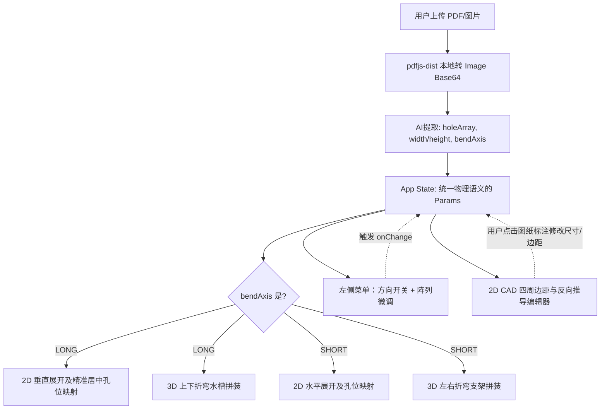

# 全新整体重构与交互升级方案 (Comprehensive & Interactive Plan)

## 概述
本计划将此前讨论的所有修复与功能演进进行大一统。旨在彻底解决底层的几何歧义（U型长槽与ㄇ字形支架的混淆）、修复漏传参数的状态同步问题、支持 PDF 转图片，并**彻底修复 2D 展开图孔位跑偏的坐标系映射 Bug**。最重要的是，将 2D 展开视图升级为**交互式 CAD 编辑器**，允许用户直接点击标注修改尺寸，并**新增孔阵列四周边界的互动与反向参数推导**。

## 详细实施步骤

### 步骤 1：统一参数定义与状态修复
- **修改 `types.ts`**:
  - 为 `SheetMetalParams` 增加字段：`bendAxis?: 'LONG' | 'SHORT'`。
- **修改 `App.tsx`**:
  - 在 `setParams` 中补全对 `result.extractedParams.holeArray` 的状态合并。
  - 为 `FlatPatternViewer` 传入 `onChange` 方法，使其能够反向修改参数状态。
- **修改 `components/ParameterControls.tsx`**:
  - 增加 **“折弯方向”控制开关 (Toggle)**，允许用户切换并双向绑定到 `params.bendAxis`。

### 步骤 2：彻底修复 2D 展开图孔位跑偏Bug
- **计算逻辑修复 (`utils/calculation.ts`)**:
  - 针对 `U_CHANNEL` 区分展开方向。水槽（`LONG`）在 Y 轴展开，支架（`SHORT`）在 X 轴展开。
- **坐标系映射重构 (`components/FlatPatternViewer.tsx`)**:
  - 现有的 `flangeFlat` 估算不够精确导致了垂直不居中。需要使用精准的折弯扣除后法兰宽度：`const flangeFlatLong = depth - bd/2;`。
  - 对于水槽型孔位计算：`cy = (flangeFlatLong + height) - hole.y`，当 `hole.y = 12.5` 且 `height = 25` 时，`cy` 将严丝合缝地落在 MAIN 面（底板）的绝对正中心。

### 步骤 3：升级交互式 2D CAD (孔阵列四周边距联动)
- **目标文件**: `components/FlatPatternViewer.tsx`
- **逻辑重构**:
  - 在 SVG 内增加可交互的尺寸标注文本，点击弹窗修改 `params`，实现 0 延迟实时同步重绘。
  - **需要添加交互的尺寸标注**：
    1. **总体长度 (Width)** 与 **截面基宽 (Height)**
    2. **孔阵列内部**：孔间距 (spacing)。
    3. **[新增] 孔阵列边界距离**：
       - **左侧边距 (startX)**：点击修改将使整排孔水平平移。
       - **右侧边距 (endMargin)**：点击修改将**触发反向推导联动**。若修改了右侧边距，在孔数与间距锁定的情况下，系统将自动重算并修改全局的 `width`（总长），实现边距驱动零件伸缩。
       - **上/下折弯距离 (startY)**：点击修改 `startY`。

### 步骤 4：重写 3D 渲染器 (ThreeDViewer)
- **目标文件**: `components/ThreeDViewer.tsx`
- **逻辑重构**:
  - `U_CHANNEL` 基于 `params.bendAxis` 分化：
    - `LONG`：拼接成上下翼缘的 U 型水槽。
    - `SHORT`：拼接成左右翼缘的 ㄇ 型支架。

### 步骤 5：强化 AI 提取逻辑与 PDF 支持
- **强化 Prompt (`qwenService.ts`)**:
  - 加入推理教程：引导 AI 计算 `15 + 200 + 15 = 230`，并强制输出正确的 `bendAxis`。
- **PDF 无损解析 (`App.tsx`)**:
  - 引入 `pdfjs-dist`，拦截 PDF 上传，在本地提取页面并用 `<canvas>` 转为无损 `image/png` Base64，确保视觉大模型（VLM）有最高质量的输入底图。

## 架构示意图 (Mermaid)

