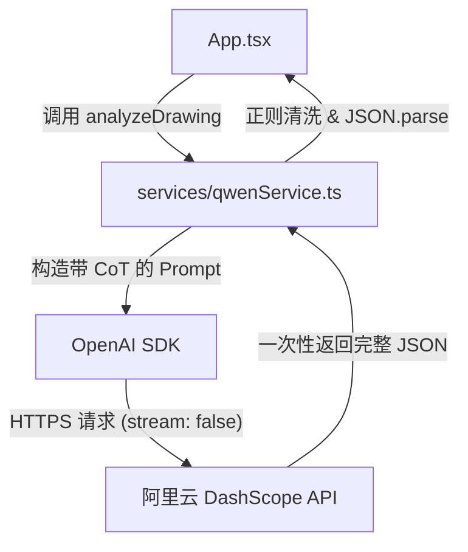

# 优化千问模型调用与 Prompt (Qwen3-VL-Plus)

## 架构调整
我们将关闭流式输出（Stream），直接等待模型返回完整的 JSON 字符串，从而彻底解决流式碎片拼接导致的 `JSON.parse` 报错问题。同时，通过 Prompt 工程让 `qwen3-vl-plus` 模拟思考过程。

## 实施步骤

1. **修改目标模型**
   - 在 `[services/qwenService.ts](services/qwenService.ts)` 中，将 `MODEL_ID` 修改为 `qwen3-vl-plus`。

2. **优化 System Prompt (引入 CoT)**
   - 修改 `SYSTEM_PROMPT` 的 JSON 结构要求，在最前面强制增加一个 `step_by_step_reasoning` 字段。
   - 明确指令要求模型在输出最终参数前，必须先在 `step_by_step_reasoning` 中写出详细的孔位阵列计算过程。
   - 同步更新 `FEW_SHOT_EXAMPLES`，在示例中展示如何进行分步计算。

3. **重构 API 调用逻辑 (移除 Stream)**
   - 将 `client.chat.completions.create` 中的 `stream: true` 改为 `stream: false`。
   - 移除 `extra_body` 中的 `enable_thinking` 和 `thinking_budget` 参数（因为 plus 模型不支持/不需要此参数）。
   - 删除 `for await (const chunk of stream)` 的拼接逻辑。
   - 直接通过 `response.choices[0].message.content` 获取完整文本结果并传递给 `extractJSON`。